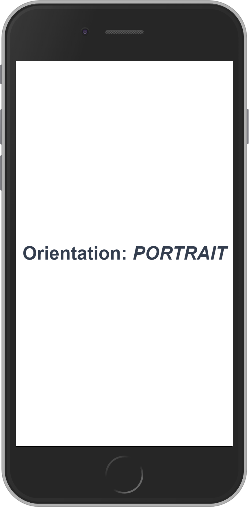
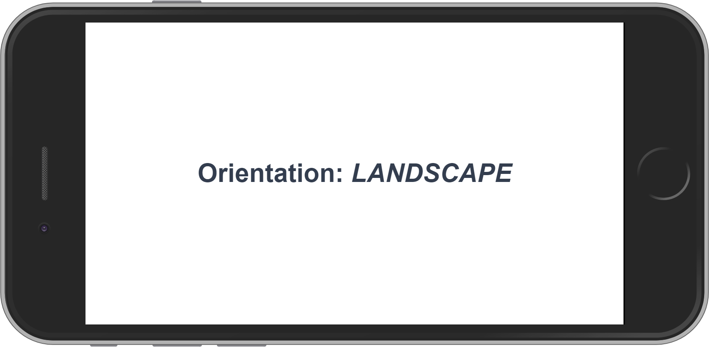

# Mobile-Orientation
Detect Mobile Portrait/Landscape on resize.
## Browser compatibility
See [MDN](https://developer.mozilla.org/en-US/docs/Web/API/Window/matchMedia).
## Install
```
npm install --save mobile-orientation
```
## Usage
```js
import { MobileOrientation } from 'mobile-orientation'

const orientation = new MobileOrientation()

console.log(orientation.state) // 'portrait'

orientation.subscribe('resize', state => console.log(state)) // portrait or landscape
orientation.subscribe('portrait', state => console.log(state)) // portrait
orientation.subscribe('landscape', state => console.log(state)) // landscape
```
Alternatively, the state can be utilized within a computed property, a la [Vue.js Computed Property](https://vuejs.org/v2/guide/computed.html).
```js
// Vue Component
export default {
    data() {
        return {
            orientation: new MobileOrientation()
        }
    },
    computed: {
        isPortrait() {
            return this.orientation.isPortrait
        },
        isLandscape() {
            return this.orientation.isLandscape
        }
    }
}
```
## Options
Time to wait before invoking detection.

#### `debounceTime`
* Type: `Number`
* Default: `50`
* Format: Milliseconds

#### `withTouch`
* Type: `Boolean`
* Default: `false`
* Description: Include touch-device when testing mobile

#### `portraitMediaQuery`
See [MDN](https://developer.mozilla.org/en-US/docs/Web/CSS/Media_Queries/Using_media_queries) for media queries syntax.

* Type: `String`
* Default: `all and (max-device-aspect-ratio: 1/1), (max-aspect-ratio: 1/1)`
* Format: CSS Media Query
* Description: The media-query to test for Portrait mode.

## Preview

<br><br>
